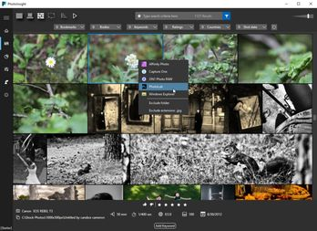

# Demo app


See the full source code in the demo application on github [here](https://github.com/ju2pom/WPF-ShortcutDemo)

# Real world application

[](https://photoinsight.io)

I've first implemented this behavior for an application I'm developing [photoinsight](https://photoinsight.io) and decided to share it with the community.

# Problem

When building an desktop application you have so many tasks to do that you'd better automate things as much as possible. In this post I'd like to present a small automation I did related to keyboard shortcuts.

Keyboard shortcuts may be considered as a power user feature, still it's a must have. This is one of the best/easiest way to let users increase productivity.

The drawback with keyboard shortcuts is that it's the worst discoverable feature in a desktop application. You can list them all in the documentation … but nobody reads documentation!

You can implement a "Tip of the day" … but it's so 2000's


 

Can you just implement keyboard shortcuts and let the user guess they exist?


# Solution

My solution to this problem is a very simple WPF behavior which automatically append a shortcut description to any element's tooltip. Basically, you define a KeyBinding at the main window level, and then anywhere else use the behavior on the UI element that should host the shortcut tooltip.

What's great with this behavior is that you don't need to manually maintain consistency between the shortcut and the tooltip.

Here is the behavior

```csharp
/// <summary>
/// Use AutomationProperties.Name on the element which tooltip should display the shortcut
/// And then assign this same name to this attached property "AutomationUIName" on the KeyBinding
/// The element's tooltip will be then updated with the shortcut
/// </summary>
public class ToolTipShortcutBehavior
{
  public static readonly DependencyProperty AutomationUINameProperty = DependencyProperty.RegisterAttached(
    "AutomationUIName",
    typeof(string),
    typeof(ToolTipShortcutBehavior),
    new FrameworkPropertyMetadata(default(string), OnAutomationUINameChanged));

  private static void OnAutomationUINameChanged(DependencyObject d, DependencyPropertyChangedEventArgs e)
  {
    UpdateSource(d as FrameworkElement, e.NewValue as string);
  }

  public static void SetAutomationUIName(DependencyObject element, string name)
  {
    element.SetValue(AutomationUINameProperty, name);
  }

  public static string GetAutomationUIName(DependencyObject element)
  {
    return (string)element.GetValue(AutomationUINameProperty);
  }

  private static void UpdateSource(FrameworkElement element, string automationUIName)
  {
    var inputBinding = Application.Current.MainWindow.InputBindings
      .OfType<InputBinding>()
      .SingleOrDefault(x => AutomationProperties.GetName(x) == automationUIName);

    string shortcut = string.Empty;
    if (inputBinding?.Gesture is KeyGesture keyGesture)
    {
      shortcut = keyGesture.DisplayString;
      if (string.IsNullOrEmpty(shortcut))
      {
        shortcut = keyGesture.Modifiers == ModifierKeys.None
            ? keyGesture.Key.ToString()
            : $"{keyGesture.Modifiers.ToString()}+{keyGesture.Key}";
      }
    }

    if (!string.IsNullOrEmpty(shortcut))
    {
      string tooltip = (element.ToolTip as string ?? string.Empty) + $" ({shortcut})";
      element.ToolTip = tooltip;
    }
  }
}
```

To use it add a KeyBinding to the main window and set a unique UI Automation name

```xml
<Window.InputBindings>
    <KeyBinding
        AutomationProperties.Name="ToggleBoldKeyBinding"
        Command="{Binding ToggleBoldCommand}"
        Gesture="Ctrl+B"
        />
</Window.InputBindings>
```

And reuse the same UI Automation name on the element

```xml
<Button
  Command="{Binding ToggleBoldCommand}"
  Content="&#xE8DD;"
  FontFamily="Segoe MDL2 Assets"
  ToolTip="Bold"
  local:ToolTipShortcutBehavior.AutomationUIName="ToggleBoldKeyBinding"
  />
```

# Limitation

* In the Xaml file you must declare the __AutomationUIName__ after the ToolTip value otherwise it gets overwritten.
* If you have a dynamic ToolTip the shortcut display will be lost
* If your ToolTip is assigned with anything else than a string it will be also overwritten 

See the full source code in the demo application on github [here](https://github.com/ju2pom/WPF-ShortcutDemo)

